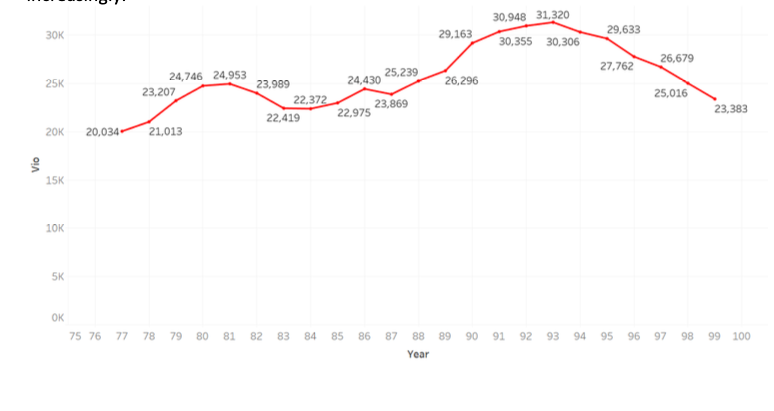
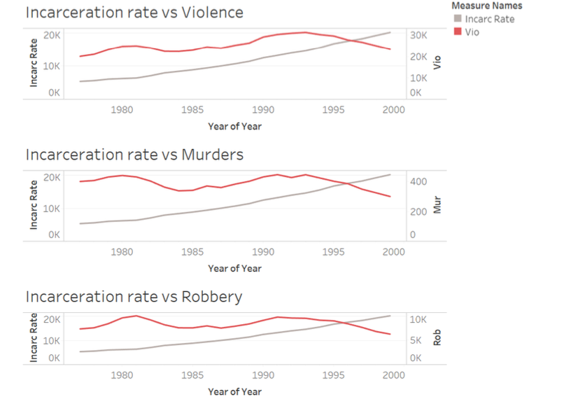
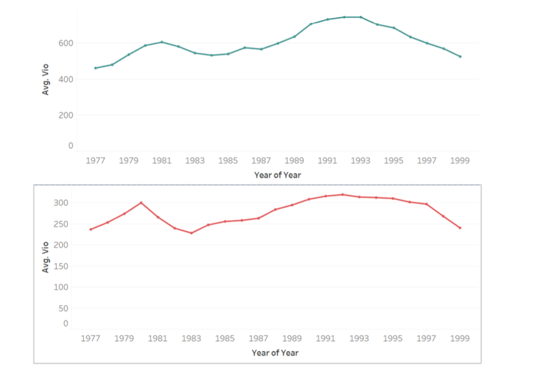
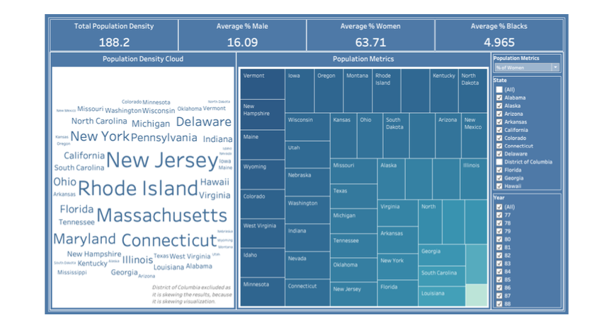
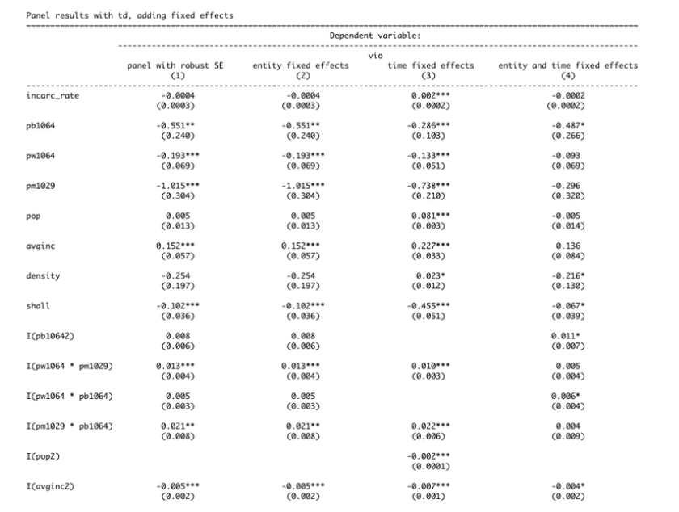

# PanelDataResearchProject

<h2> About the Dataset </h2>

Guns is a balanced panel of data on 50 US states, plus the District of Columbia (for a total of 51 “states”), by year for 1977 – 1999. Each observation is a given state in a given year.
There are a total of 51 states × 23 years = 1173 observations

<h2> Problem To be Solved </h2>

Do shall-issues law reduce crime-or not?

<h2> What is Shall Issue </h2>

The impact of guns on crime in America has triggered a lot of public debate. Many strongly believe that state laws enabling citizens to carry concealed handguns had reduced crime. According to this view, gun control laws take away guns from law-abiding citizens, while would-be criminals ignore those leaving potential victims defenceless. Following this view,The National Rifle Association (NRA) and many politicians across the country advance the cause of greater freedom to carry guns.
As a result, many states in the United States have passed right-to-carry laws (also known as a shall-issue laws).<b> A Shall-issue law is one that requires that governments issue concealed carry handgun permits to any applicant who meets the necessary criteria. These criteria are the applicant must be an adult, have no significant criminal record, and no history of mental illness and successfully complete a course in firearms safety training (if required by law). If
these criteria are met, the granting authority has no discretion in the awarding of the licenses, and there is no requirement of the applicant to demonstrate "good cause".</b> 

<h2> Exploratory Data Analysis </h2>

<h3> Shall law issued states over the years </h3>

We see that over the first ten years that is from 1977 to 1987 the increase of number of states that issued the law was slowly increasing.
But after the year 1987 and especially from year 1994 to 1997 we see a drastic peak.

<h3> Violent crime rate over the years </h3> 

This graph shows the overall violent crime rates over the years from 1977 to 1999
The highest peak of crimes can be observed during the years 1992 to 1994 and then decreased as an inclined line.
This inclination is observed during the same period where the shall law has been issued increasingly.

<h3> Has incarceration effected violent crimes? </h3>

Incarceration is the incarceration rate increases.The state of being confined in prison; imprisonment.Imprisonment creates a kind of fear among people and we expect the crimes to reduce Let us look at the following graphs which show the incarceration rate along with violent crime rate, murder rate and robbery rate.

- As the incarceration rate increased over the years, the violent crime rate has not decreased until the year of 1995.
- Same is the case with murder rate but the robbery rate that has been steady over the years reduced after 1995 in the same fashion.

<h3> States with vs without shall law from the beginning(1977) </h3>

<h3> Overall Summary Statistics </h3> 

<h2> Descriptive Analytics </h2>

There was no missing data present.

Have Applied log transformation the features which were highly skewed. 

Figured out if there is collinearity or exact collinearity present in the data.

Applied OLS Regression and figured out that the effect of Shall Issue Law on crime rate will be 27.79% which is quite high as a outcome for a law being passed and maybe this is an overestimation and can be an indication of bias.
Then applied Pooled OLS,Cluster Robust Standard errors,Fixed Effects Model & Entity Fixed Effects.

<h2> Comparison of the models </h2>

<b> Details about the results of regression and overall process is mentioned in the report.Do check out. </b>

